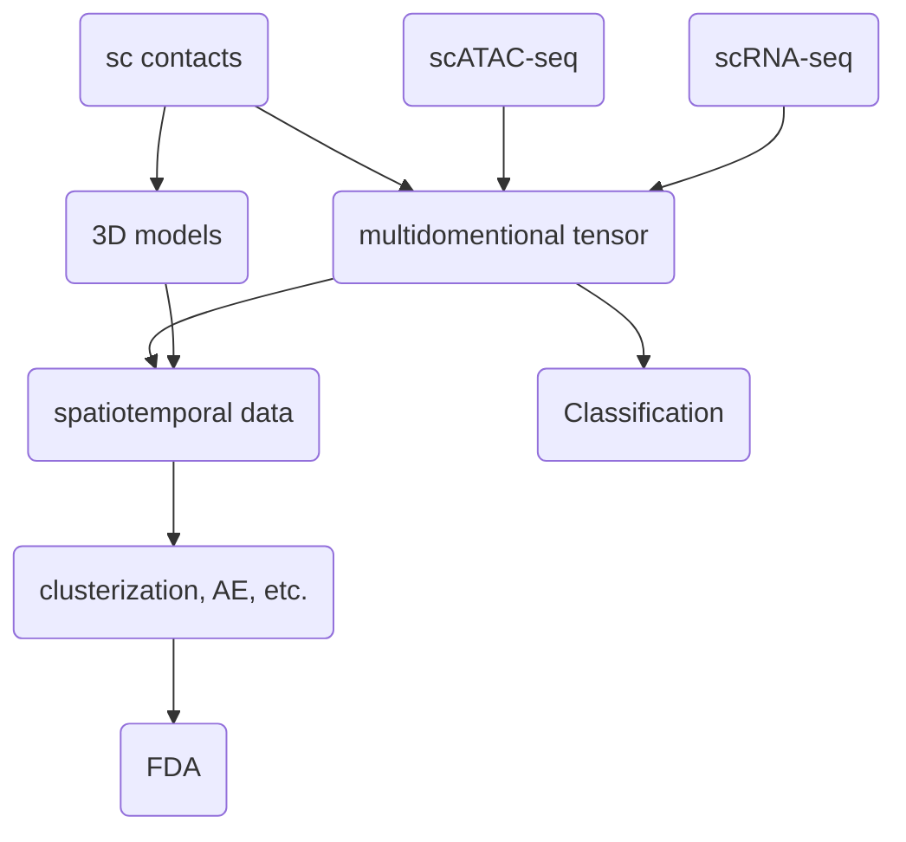

# Team8_PhaseSpecific_Chromatin_Changes

```mermaid
graph TD;
    RNA(scRNA-seq)-->T(multidomentional tensor);
    ATAC(scATAC-seq)-->T;
    HiC(sc contacts)-->T;
    HiC(sc contacts)-->3D(3D models);
    3D-->STdata(spatiotemporal data);
    T-->STdata;
    T-->classification(Classification);
    STdata-->Cluster(clusterization, AE, etc.);
    Cluster-->FDA(FDA);
```
