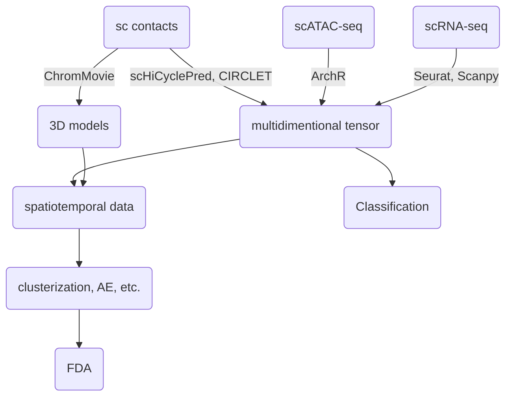

# Team8: PhaseSpecific Chromatin Changes


## Project Objective

Our projects aims at the comprehensive integration of multi-omics data sets combining information about gene expression, chromatin accessibility and contact data. Together with 3D modeling we aim at discovering unique and novel structural chromatin conformational changes along the cell cycle progression trajectory or other genomic processes such as cell maturation. We use state of the art solutions in 3D modeling together with the best models for multi-omics data analysis, clustering and pattern detection algorithms.


## Dataset

The method was primarily tested on the ChAIR data set from (Chai et al. 2025) which combines contacts from ChIA-PET methodology, scRNA-seq and scATAC-seq obtained simultaneously for thousands of cells along the cell cycle trajectory. Our algorithms are also compatible with other similar multi-omics data sets. Similarily the 3D modeling strategy ChromMovie is applicable to different types of single cell contact data.

## Tools & Dependencies

```
ArchR
scHiCyclePred
CIRCLET
ChromMovie
```

## 🧠 Methodology


## Hackathon work flowchart



#### Aggregation of average gene expresion per Phase and Pseudotime of K562 data (Agregation.ipynb)

1. Load statistics file after Seurat – only filtered cells left, which have both the ATAC and RNAseq signal. Infor,mation about Phase of the cells and Pseudotime.
2. Loading EnsemblID 2 Gene Name mapping – Gene names downloaded friom Ensembl Biomart.
3. Getting gene counts per cell from cellranger BAM file – parsing CB and GX fields (from uniq UMIs)
4. Creating expression matrix for filtered cells – Merge metadata with expression matrix.
5. Normalization per read counts per cell – Normalize gene counts per cell to 10,000 (Counts per 10k).
6. Aggregation by Phase and Pseudotime – Compute average gene expression per cell cycle phase.
7. Working on graphs.
