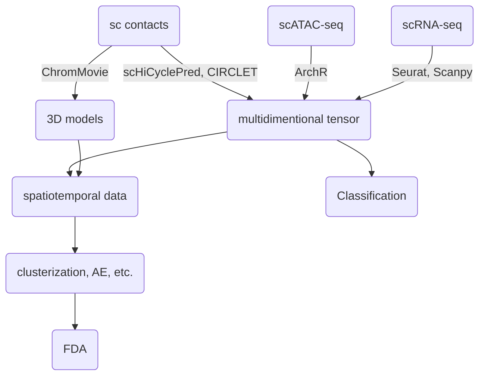

# Team8: PhaseSpecific Chromatin Changes

## 🔬 Project Objective

Our projects aims at the comprehensive integration of multi-omics data sets combining information about gene expression, chromatin accessibility and contact data. Together with 3D modeling we aim at discovering unique and novel structural chromatin conformational changes along the cell cycle progression trajectory or other genomic processes such as cell maturation. We use state of the art solutions in 3D modeling together with the best models for multi-omics data analysis, clustering and pattern detection algorithms.


## 💾 Dataset

The method was primarily tested on the ChAIR data set from (Chai et al. 2025) which combines contacts from ChIA-PET methodology, scRNA-seq and scATAC-seq obtained simultaneously for thousands of cells along the cell cycle trajectory. Our algorithms are also compatible with other similar multi-omics data sets. Similarily the 3D modeling strategy ChromMovie is applicable to different types of single cell contact data.

## 🛠️ Tools & Dependencies

```
seurat
Scanpy
ArchR
scHiCyclePred
CIRCLET
ChromMovie
```

## 🧠 Methodology


## Hackathon work flowchart


