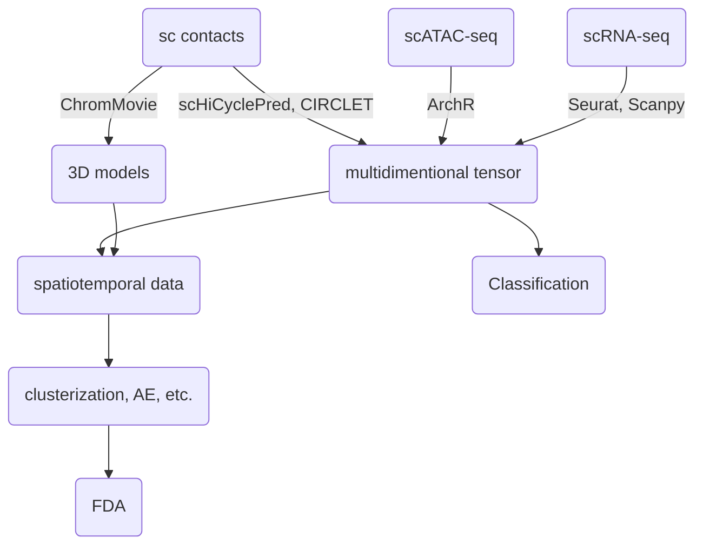

# Team8: PhaseSpecific Chromatin Changes

## 🎯Project Objectives

Chromatin undergoes dynamic structural changes throughout the cell cycle to regulate DNA accessibility, replication, and segregation. These transformations ensure that the genome remains transcriptionally active when required, is accurately replicated, and properly segregated during cell division. While the general principles of chromatin conformation changes are gradually being uncovered, much less is known about the specific structural transitions that may drive chromatin organization throughout the cell cycle.

Our project aims to comprehensively integrate multi-omics datasets—including gene expression, chromatin accessibility, and contact maps—to advance the understanding of cell cycle phase-specific chromatin dynamics. Coupled with 3D genome modeling, our approach seeks to uncover novel and distinct chromatin conformational changes along the trajectory of cell cycle progression and other genomic processes such as cellular maturation. We employ state-of-the-art 3D modeling techniques that incorporate temporal information from the cell cycle, alongside cutting-edge methods for multi-omics integration, clustering, and pattern recognition. This combined strategy is designed to reveal common principles and patterns underlying chromatin structural organization within the cell nucleus.

## 📦 Dataset

The method was primarily tested on the ChAIR data set from (Chai et al. 2025) which combines contacts from ChIA-PET methodology, scRNA-seq and scATAC-seq obtained simultaneously for thousands of cells along the cell cycle trajectory. Our algorithms are also compatible with other similar multi-omics data sets. Similarily the 3D modeling strategy ChromMovie is applicable to different types of single cell contact data.

## 🛠 Tools & Dependencies

```
ArchR
scHiCyclePred
CIRCLET
ChromMovie
```

## 🧠 Methodology


## 📉 Hackathon work flowchart



## 🏗 Future steps

1. Parameter tuning

## 🧾 Contributions

Krzysztof Banecki - team lead, 3D modeling, chromatin structure analysis

Rafał Wójcicki - RNA-seq analysis

Alicja M. Olszewska - RNA-seq analysis

Konrad Dębski - ATAC-seq analysis

Jatin Shrinet - scChIA-PET analysis

#### Aggregation of average gene expresion per Phase and Pseudotime of K562 data (Agregation.ipynb)

1. Load statistics file after Seurat – only filtered cells left, which have both the ATAC and RNAseq signal. Infor,mation about Phase of the cells and Pseudotime.
2. Loading EnsemblID 2 Gene Name mapping – Gene names downloaded friom Ensembl Biomart.
3. Getting gene counts per cell from cellranger BAM file – parsing CB and GX fields (from uniq UMIs)
4. Creating expression matrix for filtered cells – Merge metadata with expression matrix.
5. Normalization per read counts per cell – Normalize gene counts per cell to 10,000 (Counts per 10k).
6. Aggregation by Phase and Pseudotime – Compute average gene expression per cell cycle phase.
7. Working on graphs.

## 📌 References

1. Haoxi Chai, Xingyu Huang, Guangzhou Xiong, Jiaxiang Huang, Katarzyna Karolina Pels, Lingyun Meng, Jin Han, Dongmei Tang, Guanjing Pan, Liang Deng, Qin Xiao, Xiaotao Wang, Meng Zhang, Krzysztof Banecki, Dariusz Plewczynski, Chia-Lin Wei, Yijun Ruan, Tri-omic mapping revealed concerted dynamics of 3D epigenome and transcriptome in brain cells, Nature Methods (2025). https://doi.org/10.1038/s41592-025-02658-7

